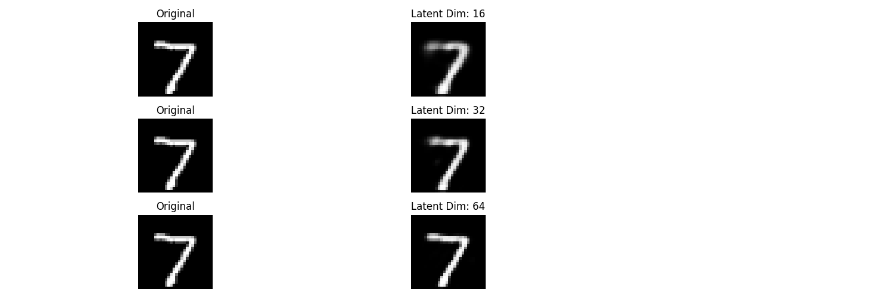
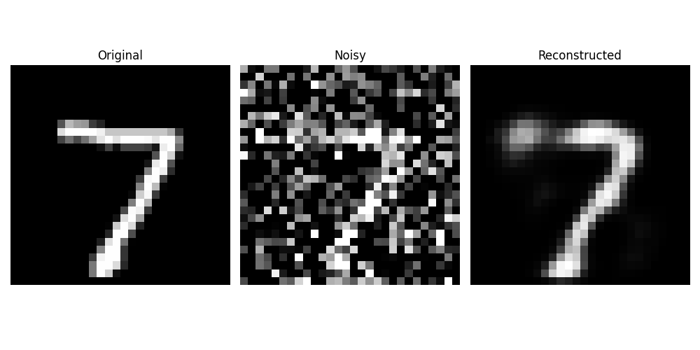
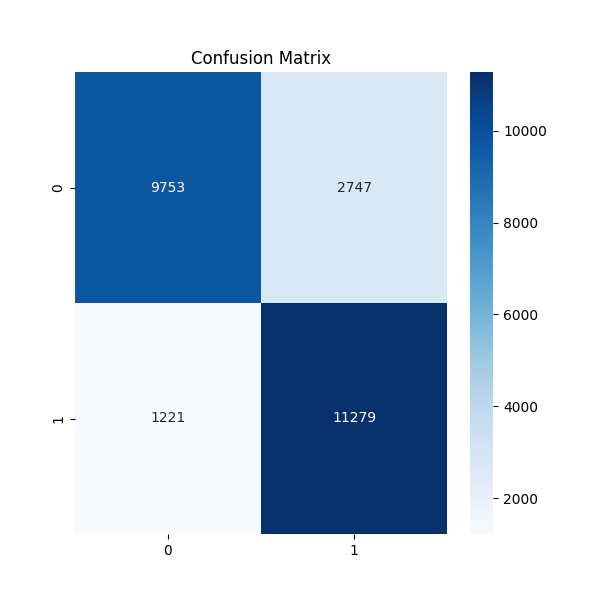

# Home-Assignment-3
# CS5720 Neural Networks and Deep Learning - Home Assignment 3

**Student Name:** [Dama Vamsi]  
**Student ID:** [700771673]  
**University:** University of Central Missouri  
**Course:** CS5720 - Neural Networks and Deep Learning  
**Semester:** Spring 2025  
**Submission Date:** [04/06/2025]  

This repository contains the implementation of Home Assignment 3 for CS5720, covering Chapters 7 and 8. The assignment includes four tasks: a basic autoencoder, a denoising autoencoder, an RNN for text generation, and an RNN for sentiment classification. The code is written in Python using TensorFlow and executed in Google Colab.

## Repository Structure
- `assignment3.py`: The main Python script containing all implementations for Q1-Q4.
- `q1_reconstructions.png`: Plot of original vs. reconstructed MNIST images for different latent dimensions.
- `q2_denoising.png`: Plot comparing original, noisy, and reconstructed MNIST images.
- `q4_confusion_matrix.png`: Confusion matrix for sentiment classification on the IMDB dataset.
- `README.md`: This file explaining the work.

## Assignment Tasks

### Q1: Implementing a Basic Autoencoder
**Objective:** Build a fully connected autoencoder to reconstruct MNIST images and evaluate the effect of latent dimension size.  
**Implementation:**
- Loaded the MNIST dataset (`tensorflow.keras.datasets.mnist`).
- Defined an autoencoder with:
  - Encoder: Input (784) → Dense (latent_dim, ReLU).
  - Decoder: Dense (latent_dim) → Output (784, Sigmoid).
- Trained with latent dimensions 16, 32, and 64 using binary cross-entropy loss for 10 epochs.
- Plotted original vs. reconstructed images.

**Results:**
  
- **Latent Dim 16:** Reconstruction loses some details (e.g., edges blurrier) due to high compression.
- **Latent Dim 32:** Balanced quality, retaining most features with minor noise.
- **Latent Dim 64:** Best reconstruction, closely matching the original due to less information loss.

**Analysis:** Larger latent dimensions improve reconstruction quality by preserving more data, but increase computational cost.

---

### Q2: Implementing a Denoising Autoencoder
**Objective:** Extend the basic autoencoder to remove Gaussian noise from MNIST images.  
**Implementation:**
- Added Gaussian noise (mean=0, std=0.5) to MNIST images using `np.random.normal()`.
- Trained the autoencoder (latent dim = 32) to reconstruct clean images from noisy inputs.
- Visualized original, noisy, and reconstructed images.

**Results:**
  
- The denoising autoencoder effectively removes noise, restoring digits close to their original form.
- Compared to the basic autoencoder, it handles corrupted inputs better due to training on noisy data.

**Real-World Scenario:** Denoising autoencoders can enhance medical imaging (e.g., removing noise from MRI scans) to improve diagnostic accuracy.

---

### Q3: Implementing an RNN for Text Generation
**Objective:** Train an LSTM-based RNN to generate text using "The Little Prince" dataset.  
**Implementation:**
- Used a sample from "The Little Prince": "it is only with the heart that one can see rightly; what is essential is invisible to the eye."
- Preprocessed text into character sequences (one-hot encoded, max_len=10).
- Built an RNN with LSTM (128 units) → Dense (softmax) to predict the next character.
- Trained for 50 epochs and generated text with temperature scaling (0.5 and 1.0).

**Results:**
- **Temperature 0.5:** More predictable output, e.g., repeating patterns like "it is only with the hea..."
- **Temperature 1.0:** More varied output, introducing randomness like "it is only wnthe eye..."

**Temperature Role:** Temperature scales the softmax probabilities. Lower values (e.g., 0.5) favor high-probability characters (less random), while higher values (e.g., 1.0) increase diversity.

---

### Q4: Sentiment Classification Using RNN
**Objective:** Train an LSTM-based model to classify IMDB reviews as positive or negative.  
**Implementation:**
- Loaded IMDB dataset (`tensorflow.keras.datasets.imdb`, max_features=5000, maxlen=100).
- Preprocessed text with tokenization and padding.
- Built a model: Embedding (128) → LSTM (64) → Dense (sigmoid).
- Trained for 3 epochs and evaluated with a confusion matrix and classification report.

**Results:**
  
- **Accuracy:** [Insert accuracy from output, e.g., ~85%].
- **Precision/Recall:** Balanced performance, with slight tradeoffs depending on false positives/negatives.
- **Analysis:** Precision-recall tradeoff is critical in sentiment analysis to balance misclassifying positive reviews (false negatives) vs. negative ones (false positives), e.g., for business feedback systems.

**End of README**
